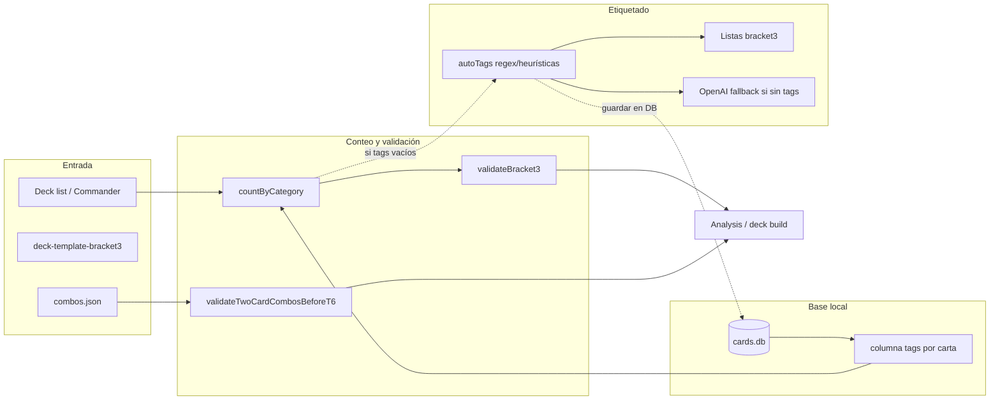

# Plan: Optimización Bracket 3 con auto-tagging y validaciones

## Estado actual

- **Template** [data/deck-template-bracket3.json](data/deck-template-bracket3.json): 14 categorías (lands, ramp, card_draw, card_selection, spot_removal, artifact_enchantment_hate, graveyard_hate, board_wipes, protection, value_engines, win_conditions, game_changers, extra_turns) y `policies` (max_game_changers, max_extra_turn_cards, ban_mass_land_denial, ban_extra_turn_chains, ban_2card_gameenders_before_turn: 6).
- **Clasificación** [src/core/roles.ts](src/core/roles.ts): solo 8 roles (land, ramp, target_removal, board_wipe, card_draw, protection, tutor, wincon). No cubre: card_selection, spot_removal (nombre distinto a target_removal), artifact_enchantment_hate, graveyard_hate, value_engines; y no distingue game_changer/extra_turn a nivel de rol (eso va por listas en [src/core/bracketCards.ts](src/core/bracketCards.ts)).
- **Análisis** [src/core/analyzer.ts](src/core/analyzer.ts): usa `classifyCardRoles` y un `roleToCategoryMap` que mapea target_removal → target_removal; el template usa **spot_removal**. Las categorías del template no se cubren todas.
- **Deck builder** [src/core/deckBuilder.ts](src/core/deckBuilder.ts): autofill solo rellena ramp, card_draw, target_removal, board_wipes; no usa el resto del template.
- **Reglas** [data/bracket-rules.json](data/bracket-rules.json): ya tiene `allowInfiniteTwoCardCombosBeforeTurnSix: false` y `maxExtraTurnCards: 3`; no hay lógica que valide combos 2-carta antes T6 ni “no chaining” de extra turns.
- **Fuente de cartas**: SQLite [src/core/cardDatabase.ts](src/core/cardDatabase.ts) (oracle_text, type_line, cmc, all_parts, etc.) e import desde [data/oracle-cards.json](data/oracle-cards.json) vía [src/scripts/importCards.ts](src/scripts/importCards.ts). No hay columna `tags`; la clasificación es siempre on-the-fly.

## Arquitectura objetivo

## 1. Tipos y utilidades de auto-tagging

- **Nuevo módulo** `src/core/autoTags.ts`:
  - Tipos: `ScryCard` (compatible con `OracleCard` + `tags?: string[]`) y `AutoTagOptions` (listas opcionales: massLandDenialNames, lockPieceNames, comboPieceNames, fastManaNames, tutorNames, gameChangerNames) para overrides.
  - Helpers: `norm(s)`, `hasText(card, re)`, `hasType(card, re)`.
  - `**autoTags(card, opt)`**: aplicar regex/heurísticas sobre `oracle_text`, `type_line`, `cmc`, `all_parts` para emitir tags alineados con el template:
    - Tags: ramp, card_draw, card_selection, spot_removal, artifact_enchantment_hate, graveyard_hate, board_wipe, protection, value_engine, win_condition, extra_turn, game_changer, mass_land_denial, tutor, fast_mana, combo_piece, lock_piece, spell_copy, recursion (para “no chaining”).
  - Respetar **overrides** desde listas Bracket 3: al construir `AutoTagOptions`, rellenar `gameChangerNames` / massLandDenial / extraTurns desde [bracketCards.ts](src/core/bracketCards.ts) (leer listas una vez y pasar como Sets).
  - **Mapeo tag → categoría template**: función `tagsToTemplateCategories(tags)` que devuelve categorías del template (p. ej. board_wipe → board_wipes, value_engine → value_engines, win_condition → win_conditions, extra_turn → extra_turns, game_changer → game_changers). Así el conteo por categoría del template es directo.

## 2. Base local de categorización (persistir tags)

- **Objetivo**: no recalcular la categorización en cada análisis; leer tags desde un almacén local y solo computar cuando falten.
- **Almacén**: columna `tags` en la tabla `cards` (SQLite), tipo `TEXT` con JSON array de strings, ej. `["ramp","card_draw"]`. Alternativa: tabla `card_tags(oracle_id, tag)` si se prefiere normalizado; para simplicidad y una sola lectura por carta, columna JSON en `cards` es suficiente.
- **Esquema**:
  - En [src/scripts/createDatabase.ts](src/scripts/createDatabase.ts): añadir columna `tags TEXT` a `cards` (nullable; migración o `--keep` añadiendo la columna si no existe).
  - En [src/core/cardDatabase.ts](src/core/cardDatabase.ts): incluir `tags` en `DatabaseCard` y en la query de `findCardByName`; parsear JSON a `string[]` al leer.
  - En [src/core/scryfall.ts](src/core/scryfall.ts): `OracleCard` ya puede tener `tags?: string[]`; `dbCardToOracleCard` debe mapear `tags` desde la DB.
- **Poblado de la base de categorización**:
  - **Script** `npm run db:tag` (o `src/scripts/tagCards.ts`): recorre todas las cartas de la DB (por `oracle_id` único para no duplicar trabajo en múltiples impresiones), para cada una llama `autoTags(card, bracket3Overrides)`, y hace `UPDATE cards SET tags = ? WHERE oracle_id = ?`. Opcional: si una carta queda sin tags y hay API OpenAI, llamar al clasificador LLM y guardar el resultado.
  - **Integración en import**: opcionalmente, al final de [src/scripts/importCards.ts](src/scripts/importCards.ts) no ejecutar tagging (el JSON es grande); dejar que el usuario ejecute `npm run db:tag` después. O ofrecer flag `npm run db:import -- --tag` que al terminar ejecute el tagging en lote.
- **Flujo en runtime** (analyzer, deckBuilder):
  - Al necesitar tags de una carta: `getCardByName` → si la carta tiene `tags` en DB y no está vacío, **usar esos tags**.
  - Si no hay tags guardados (columna null o vacía): llamar `autoTags(card, bracket3Overrides)`; opcionalmente si `useLLMFallbackForCategories` y sigue sin tags, usar LLM; y **opcionalmente persistir** el resultado en la DB (`UPDATE cards SET tags = ? WHERE oracle_id = ?`) para la próxima vez (write-through cache).
- **Ventajas**: análisis y deck build mucho más rápidos; re-tagging solo cuando se añaden cartas nuevas o se cambian heurísticas/listas, ejecutando `npm run db:tag` de nuevo.

## 3. Fallback con OpenAI para categorización

- En `autoTags` (o en un wrapper usado por analyzer/deckBuilder): si tras heurísticas la carta no tiene ningún tag de categoría de template (o solo “other”), llamar a un **servicio opcional** que use OpenAI para clasificar la carta en una o más categorías del template.
- Condiciones: solo si `OPENAI_API_KEY` está definido y la carta sigue sin tags útiles; límite razonable (ej. 1 request por carta, timeout) para no disparar costes.
- El resultado de la LLM se traduce a tags (ej. “ramp”, “card_draw”) y se usan en `countByCategory` y en el análisis.
- Ubicación sugerida: `src/core/llmCardClassifier.ts` (o dentro de [src/core/llmConfig.ts](src/core/llmConfig.ts) + función en autoTags). El analyzer/deckBuilder pasarían un flag tipo `useLLMFallbackForCategories?: boolean`.

## 4. Conteo por categoría y uso en analyzer

- `**countByCategory(deckCards)`**: para cada carta, obtener tags (autoTags + fallback LLM si aplica); por cada tag mapear a categoría del template y sumar. Convención: un tag puede contar en una sola categoría (evitar doble conteo ramp+value_engine salvo que se defina que una carta pueda aportar a varias).
- **Analyzer** [src/core/analyzer.ts](src/core/analyzer.ts):
  - Sustituir/ampliar el flujo actual: en lugar de solo `classifyCardRoles` + `roleToCategoryMap`, usar `autoTags(card, overrides)` y `tagsToTemplateCategories` para rellenar `categoryCounts` para **todas** las categorías del template.
  - Mantener compatibilidad con lands: seguir considerando `type_line` land como categoría lands (no solo tags).
  - Incluir en el resultado las mismas categorías que define el template (incluidas game_changers, extra_turns) para que los resúmenes y notas reflejen Bracket 3.
  - Llamar a **validateBracket3** y **validateTwoCardCombosBeforeT6** (ver abajo) y añadir errores/warnings a `bracketWarnings` y/o `notes`.

## 5. Validaciones Bracket 3

- **Nuevo módulo** `src/core/bracket3Validation.ts` (o extensión de [src/core/brackets.ts](src/core/brackets.ts)):
  - `**validateBracket3(deckCards, templateOrPolicies)`**:
    - Conteo por categoría (usando tags ya calculados).
    - Errores: game_changers > max, extra_turns > max, mass_land_denial > 0.
    - Warnings: “posible chaining” si hay extra_turn y (spell_copy + recursion) por encima de un umbral (ej. 6); requiere tags spell_copy y recursion en autoTags.
  - `**validateTwoCardCombosBeforeT6(deckCards, combos)`**:
    - Definición: tipo `ComboDef { id, pieces: string[], size: number, turnFloor: number }`.
    - Lista de combos en `data/combos.json` (o módulo `src/core/combos.ts` que exporte un array). Incluir combos clásicos (Thoracle, Kiki-Jiki, etc.) con turnFloor < 6.
    - Si el mazo contiene todas las piezas de un combo de 2 cartas con turnFloor < 6 → error.
  - Las políticas (max_game_changers, etc.) pueden leerse del template [deck-template-bracket3.json](data/deck-template-bracket3.json) (`policies`) o de [bracket-rules.json](data/bracket-rules.json); unificar en una sola fuente (recomendación: template.policies como override opcional, por defecto bracket-rules).

## 6. Deck builder y autofill

- **Prioridad de categorías para autofill**: ampliar desde las 4 actuales a todas las no-land del template: ramp, card_draw, card_selection, spot_removal, artifact_enchantment_hate, graveyard_hate, board_wipes, protection, value_engines, win_conditions; game_changers y extra_turns hasta el máximo permitido.
- **Matching de cartas**: en lugar de `classifyCardRoles` + `cardRolesToCategories`, usar `autoTags(card, overrides)` y comprobar si algún tag mapea a la categoría que se quiere rellenar.
- **Respetar** límites de Game Changers y Extra Turns durante el autofill (ya se hace en parte; asegurar que el conteo use los nuevos tags).
- **Validación post-autofill**: llamar validateBracket3 y validateTwoCardCombosBeforeT6 y añadir avisos en notes.

## 7. LLM deck builder

- En [src/core/llmDeckBuilder.ts](src/core/llmDeckBuilder.ts): actualizar el system/user prompt para mencionar explícitamente las categorías del Bracket 3 y los límites (game changers ≤3, extra turns ≤3, no MLD, no 2-card combos antes T6).
- Tras recibir la lista de 99 cartas, ejecutar validateBracket3 y validateTwoCardCombosBeforeT6; si hay errores, incluirlos en `notes` (y opcionalmente intentar una pasada de “sustitución” de cartas problemáticas o solo reportar).

## 8. Archivos a crear/modificar (resumen)

| Acción    | Archivo                                                                                                                                            |
| --------- | -------------------------------------------------------------------------------------------------------------------------------------------------- |
| Modificar | `src/scripts/createDatabase.ts`: añadir columna `tags TEXT` a la tabla `cards` (o migración con `--keep`)                                          |
| Modificar | `src/core/cardDatabase.ts`: incluir `tags` en `DatabaseCard` y en las queries; parsear JSON a `string[]`                                           |
| Modificar | `src/core/scryfall.ts`: mapear `tags` en `dbCardToOracleCard`; `OracleCard.tags` opcional                                                          |
| Crear     | `src/scripts/tagCards.ts`: script que recorre cartas (por oracle_id), llama `autoTags`, hace `UPDATE cards SET tags = ?`; comando `npm run db:tag` |
| Crear     | `src/core/autoTags.ts` (autoTags, norm, hasText, hasType, tagsToTemplateCategories, AutoTagOptions)                                                |
| Crear     | `src/core/bracket3Validation.ts` (validateBracket3, validateTwoCardCombosBeforeT6)                                                                 |
| Crear     | `data/combos.json` (array de ComboDef para 2-carta antes T6)                                                                                       |
| Crear     | `src/core/llmCardClassifier.ts` (clasificación OpenAI fallback; opcionalmente usado desde tagCards.ts para cartas sin tags)                        |
| Modificar | `src/core/roles.ts`: mantener `classifyCardRoles` para compatibilidad; opcionalmente que use autoTags internamente                                 |
| Modificar | `src/core/analyzer.ts`: leer tags desde carta (DB); si vacíos, autoTags + opcional LLM y persistir; countByCategory y validaciones                 |
| Modificar | `src/core/deckBuilder.ts`: autofill por todas las categorías; matching vía tags (leídos de DB); validaciones post-autofill                         |
| Modificar | `src/core/llmDeckBuilder.ts`: prompts Bracket 3; validaciones post-build                                                                           |
| Modificar | `src/core/types.ts`: ComboDef; DeckTemplate.policies; OracleCard.tags                                                                              |

## 9. Orden de implementación sugerido

1. **Base local de categorización**: añadir columna `tags` en `createDatabase.ts`; en `cardDatabase.ts` y `scryfall.ts` leer/escribir `tags`. Crear `src/scripts/tagCards.ts` y comando `npm run db:tag` que recorra cartas (por oracle_id), ejecute `autoTags` y haga UPDATE.
2. Implementar `autoTags.ts` (regex + overrides desde bracketCards) y `tagsToTemplateCategories`.
3. Añadir `bracket3Validation.ts` y `data/combos.json`; integrar en analyzer (conteo por tags y validaciones).
4. Adaptar analyzer: obtener tags desde la carta (DB); si faltan, calcular con autoTags y opcionalmente persistir (y LLM fallback si se desea); countByCategory y validaciones Bracket 3.
5. Añadir `llmCardClassifier.ts`; usarlo como fallback en analyzer y opcionalmente en `tagCards.ts` para cartas sin tags.
6. Extender deckBuilder autofill a todas las categorías (usando tags de la DB) y validaciones post-autofill.
7. Actualizar llmDeckBuilder (prompts Bracket 3 + validaciones).

## 10. Riesgos y mitigación

- **Falsos positivos/negativos en tags**: mitigar con listas curadas (game_changers, MLD, extra_turns ya existen) y con el fallback LLM para casos dudosos.
- **Rendimiento**: la base local evita recalcular en cada análisis; solo se ejecuta autoTags (o LLM) cuando la carta no tiene tags guardados; el script `db:tag` permite re-categorizar todo el set cuando se actualicen heurísticas o listas.
- **Combos**: la lista en combos.json debe mantenerse manualmente; documentar formato y añadir 10–15 combos conocidos como punto de partida.
- **Actualización de tags**: si se cambian las listas Bracket 3 (game-changers, MLD, extra-turns) o la lógica de autoTags, hay que volver a ejecutar `npm run db:tag` para refrescar la base local.

