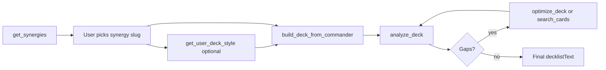

# AGENTS.md — MTG Commander Analyzer MCP

Entry point for LLM agents building or analyzing **Bracket 3** Commander decks in this repo.

## Recommended flow



1. **`get_synergies`** — list themes for the commander; **ask the user** which slug to use.
2. **`get_user_deck_style`** (optional) — read-only profile from **`data/my_decks`** (your imported Moxfield decks): land counts, mana mix, staple lands. Use when the user wants builds aligned with **their** mana base habits. Set `useOpenAI: true` only for narrative analysis (requires `OPENAI_API_KEY`).
3. **`get_strategy_guide`** (optional) — read construction principles for the chosen slug.
4. **`build_deck_from_commander`** — full 99-card list (`useTemplateGenerator: true` default); **`useUserStyleReference: true`** by default biases land count and mana base toward `data/my_decks`. **Never** save generated decks to `data/my_decks`. Use returned **`decklistText`**.
5. **`analyze_deck`** — categories, Bracket 3, banlist, `recommendations`, `synergyScore`, `decklistText`.
6. **`optimize_deck`** — automated cut/add + EDHREC autofill loop when gaps remain.
7. Fix remaining gaps with **`search_cards`** (real names only); re-analyze until legal and on-theme.

## Decision tree

| Situation | Tool / action |
|-----------|----------------|
| User names a commander, no strategy yet | `get_synergies` → ask user to pick slug |
| User picked slug, wants a new list | `build_deck_from_commander` with `preferredStrategy`, `useUserStyleReference: true` (default) |
| User asks how they build / mana base taste | `get_user_deck_style` (`commanderName` optional); `useOpenAI: true` if narrative needed |
| User wants generic template mana only | `build_deck_from_commander` with `useUserStyleReference: false` |
| User pasted a decklist | `analyze_deck` with `commanderName` + `preferredStrategy` |
| Categories `below` or weak synergy | `optimize_deck` (max 4 passes) or manual `search_cards` + re-analyze |
| Unsure about one swap | `evaluate_card_swap` |
| Need archetype ratios / packages | `get_strategy_guide` or `docs/strategy-guides/{slug}.md` |
| Mana base lint warnings | `docs/mana-base-guide.md`; adjust lands/ramp |
| Finding replacement cards | `search_cards` with `category` + `colorIdentity` |

## MCP tools

| Tool | Purpose | Key params | Defaults |
|------|---------|------------|----------|
| `get_synergies` | Discover synergy slugs | `commanderName` | — |
| `get_strategy_guide` | Archetype construction guide | `commanderName`, `preferredStrategy` | — |
| `get_user_deck_style` | Your imported decks: land stats, staples, category averages | `commanderName`, `useOpenAI`, `question` | `useOpenAI` **false**; needs `OPENAI_API_KEY` for narrative |
| `build_deck_from_commander` | Build 99-card mainboard | `commanderName`, `preferredStrategy`, `useUserStyleReference`, `useOpenAIEnhancement` | `useEdhrec` **true**, `useEdhrecAutofill` **true**, `useTemplateGenerator` **true**, `useUserStyleReference` **true**, `useOpenAIEnhancement` **true** (when `OPENAI_API_KEY` set), `refineUntilStable` **true**, `maxRefinementIterations` **5** |
| `analyze_deck` | Validate + recommend | `deckText`, `commanderName`, `preferredStrategy`, `inferCommander` | `templateId` **bracket3**, `inferCommander` **true** |
| `optimize_deck` | Auto improve deck | `deckText`, `commanderName`, `preferredStrategy`, `maxIterations` | `maxIterations` **4** |
| `evaluate_card_swap` | Preview one swap | `deckText`, `commanderName`, `cardToRemove`, `cardToAdd` | — |
| `apply_deck_changes` | Apply cut/add swaps safely | `deckText`, `swaps[]` (`remove`/`add` per swap), optional `commanderName` | Returns updated `decklistText`; no `responseMode` param |
| `get_category_candidates` | Ranked adds for one category gap | `commanderName`, `category`, `preferredStrategy`, `excludeNames` | `limit` **15**; use after `prioritizedActions` |
| `search_cards` | Query `data/cards.db` | `query`, `colorIdentity`, `category`, `commanderName`, `preferredStrategy` | `commanderLegal` **true**, `limit` **20** |
| `resolve_card` | Resolve one name + legality/color fit | `cardName`, optional `commanderName` | Use before manual adds when unsure of exact name |

**Response size:** Tools with a `responseMode` param default to **brief** (`apply_deck_changes` has no `responseMode`; responses are always compact). On build/analyze/optimize, read `agentBrief` and `qualityGate` first. In **brief** `analyze_deck`, use `analysis.prioritizedActions` (and `agentBrief`) for fixes — `recommendations.cuts` / `.adds` / `.swaps` and `synergyPackages` are **empty or omitted** (`toBriefAnalyzeResult` in `src/mcp/mcpResponseFormat.ts`). Pass `responseMode: "full"` when you need thematic cut/add pairs or synergy packages. On `search_cards`, `get_synergies`, and `get_strategy_guide`, brief mode omits long oracle text and full guide markdown.

**Architecture:** the Cursor agent is the LLM; MCP provides data, validation, and deterministic build/optimize. `build_deck_from_commander` fills gaps with EDHREC + local SQLite (`search_cards` / `searchCardsFiltered` fallback).

`preferredStrategy` is an **EDHREC theme slug** (not free text). Examples: `tokens`, `voltron`, `counters`, `blink`, `aristocrats`, `group-slug`.

## MCP resources (read-only)

The server exposes static project files via MCP `resources/list` and `resources/read`. URI prefix: `mtg-commander:///`.

| URI | Content |
|-----|---------|
| `mtg-commander:///template/bracket3` | `data/deck-template-bracket3.json` |
| `mtg-commander:///banlist` | `data/Banlist.txt` |
| `mtg-commander:///bracket-rules` | `data/bracket-rules.json` |
| `mtg-commander:///bracket3/policy-reference` | Fast mana + Bracket 3 policy JSON |
| `mtg-commander:///docs/bracket3-official-rules` | Official rules (Moxfield + Wizards) |
| `mtg-commander:///agents` | This file (`AGENTS.md`) |
| `mtg-commander:///strategy-guides/index` | Slug → file map |
| `mtg-commander:///strategy-guides/meta` | Ratios, packages, anti-patterns |
| `mtg-commander:///strategy-guide/{slug}` | e.g. `.../strategy-guide/tokens` → `docs/strategy-guides/tokens.md` |
| `mtg-commander:///docs/bracket3-template-for-agents` | Bracket 3 agent reference |
| `mtg-commander:///user-decks/index` | Imported deck manifest (`data/my_decks/index.json`) |
| `mtg-commander:///user-decks/style-profile` | Aggregated mana base / category stats from your decks |
| `mtg-commander:///docs/user-deck-style-reference` | How style reference works (read-only library) |
| `mtg-commander:///docs/commander-guides/aloy-discover` | Aloy Discover / artifact-creature triggers, scoring caveats |
| `mtg-commander:///deck-knowledge/discover-artifact-heuristics` | JSON heuristics for Discover + `artifacts` slug builds |
| `mtg-commander:///reference-decks/aloy-discover-bracket3` | Validated reference list (99 cards, Bracket 3) |

Prefer resources for template ratios and strategy guides; use **`get_user_deck_style`** or **`user-decks/style-profile`** for personal mana-base bias; use tools for commander-specific EDHREC data and deck validation.

## User deck style reference (`data/my_decks`)

- **Purpose:** Learn from **your real imported decks** (Moxfield → `npm run decks:download-moxfield`), mainly **land count** and **mana base staples**.
- **Build integration:** `useUserStyleReference` (default **true**) on `build_deck_from_commander` — does **not** require OpenAI.
- **Import-only:** Generated decklists must **never** be written to `data/my_decks`.
- **OpenAI (optional):** `get_user_deck_style` + `useOpenAI: true` for narrative “how I build” analysis; `build_deck_from_commander` + `useOpenAIEnhancement: true` (default) for category gap-fill when `OPENAI_API_KEY` is set. Build/analyze work without a key.
- **Full guide:** `docs/user-deck-style-reference.md`

## MCP prompts (workflow templates)

The server exposes prompts via MCP `prompts/list` and `prompts/get`:

| Prompt | Arguments | Purpose |
|--------|-----------|---------|
| `build-commander-deck` | `commanderName` (required), `preferredStrategy` (optional) | Embeds AGENTS build flow, Bracket 3 category table, quality checklist |
| `optimize-decklist` | `commanderName`, `preferredStrategy` (required), `deckText` (optional) | Optimize loop with `optimize_deck`, `evaluate_card_swap`, quality gate |

Use prompts when the host supports MCP Prompts to seed agent context; tools still perform all validation and deck mutations.

## EDHREC disk cache

EDHREC JSON responses are cached in memory and on disk at `data/cache/edhrec/` (24h TTL default). Survives MCP restarts; reduces repeated API calls during build/optimize loops. Override: `EDHREC_CACHE_TTL_HOURS`, `EDHREC_CACHE_DIR`.

## Quality checklist (before delivering a deck)

- [ ] Exactly **99** mainboard cards (+ 1 commander), singleton except basics
- [ ] Every card resolves in `cards.db` (no invented names)
- [ ] Color identity: all cards ⊆ commander colors
- [ ] `analysis.banlistValid` === true
- [ ] No hard `format:*` or Bracket 3 errors in `analysis.lintReport` / `bracketWarnings`
- [ ] No category `below` minimum (see table below) unless user accepted tradeoff
- [ ] `synergyScore` ≥ 60 when `preferredStrategy` is set (aim higher for focused builds)
- [ ] One synergy only — no mixed themes without explicit user request
- [ ] **`qualityGate.readyToShip === true`** or explicit user acceptance of remaining `polish` gaps

## MCP response fields (read these first)

After every **build**, **analyze**, or **optimize** call, use structured fields — not only `analysis.notes[]`.

| Field | When present | Agent action |
|-------|----------------|--------------|
| **`agentBrief`** | build / analyze / optimize | **Read first** — compact summary, gaps, `decklistText`, `nextSuggestedAction` |
| `qualityGate` | build / analyze / optimize | `readyToShip`, `blocking[]`, `polish[]` — delivery gate on all three tools |
| `summary` | build / analyze / optimize / get_synergies / search_cards / evaluate_card_swap | One-line status |
| `nextSuggestedAction` | same | Next MCP tool to call |
| `decklistText` | build / analyze / optimize | Copy-paste mainboard |
| `converged` | build / analyze / optimize | `true` → run quality checklist; `false` → fix gaps |
| `remainingGaps[]` | build / analyze / optimize | `{ kind, detail }` — category, lint, bracket, banlist, format, synergy |
| `buildQualityReport.overall` | build | `strong` \| `acceptable` \| `needs_work` |
| `metricsBefore` / `metricsAfter` | optimize | Track synergy and categoriesBelow |
| `analysis.prioritizedActions` | analyze | Ordered fixes (prefer over `recommendations.prioritizedActions`); use `suggestedSearch` with `search_cards` |
| `recommendations.swaps` | analyze (`responseMode: "full"`) | Thematic cut/add pairs — omitted in default brief |
| Off-theme cut hints | analyze (with strategy) | In `analysis.notes` as `Possible off-theme cards: …` — not a top-level JSON field |
| `analysis.unresolvedCardNames` | analyze | Names not in `cards.db` — fix before delivery |

**Commander without `commanderName` param:** include `Commander: Exact Name` in `deckText`, or rely on **`inferCommander: true`** (default) to use the first commander-eligible legendary in the list.

**Stop delivering when:** `qualityGate.readyToShip === true` **or** (manual checklist) no category `below`, `banlistValid`, no hard lint, `synergyScore ≥ 60`, Bracket 3 clean.

**Not a JSON field:** `analysisHasAutomatableGaps` is internal code only. Use `converged`, `remainingGaps`, or category `below` instead.

## Troubleshooting MCP / database

| Symptom | Fix |
|---------|-----|
| MCP server **errored** in Cursor | Settings → MCP → verify `npm run mcp`, correct `cwd`, Node LTS |
| `search_cards.databaseReady === false` | `npm rebuild better-sqlite3` then `npm run db:create && npm run db:import` |
| NODE_MODULE_VERSION / better-sqlite3 | Align Node version with build; `npm rebuild better-sqlite3` |
| Empty search with no `error` | Always pass at least one of `category`, `query`, `type`, `colorIdentity`, `commanderName`, `maxMV`, or `commanderLegal: false`; read `summary` + `nextSuggestedAction` |
| Commander not found | Exact Scryfall name; try `resolve_card` |

Full guide: `docs/agent-mcp-troubleshooting.md`. Skill: `.cursor/skills/mtg-mcp-troubleshoot/SKILL.md`.

## Common mistakes and fixes

| Mistake | Fix |
|---------|-----|
| Building before user picks synergy | `get_synergies` → confirm slug |
| Guessing card names | `search_cards` or build/EDHREC output only |
| Ignoring `below` categories | `optimize_deck` or targeted `search_cards` |
| Chasing synergy score over legality | Fix `lintReport` hard issues first |
| Over-cutting during optimize | Cap iterations; verify 99 cards after each pass |
| Wrong category mins in docs | Use table below (from `deck-template-bracket3.json`) |
| Mixed EDHREC themes | Single `preferredStrategy` per deck |

## Bracket 3 categories (`deck-template-bracket3.json`)

| Category | Min–max | Role |
|----------|---------|------|
| `lands` | 35–38 | Mana base (EDHREC + template mix) |
| `ramp` | 9–12 | Rocks, dorks, land ramp |
| `card_draw` | 8–11 | Raw card advantage |
| `card_selection` | 3–6 | Scry/surveil/filter |
| `spot_removal` | 4–7 | Single-target |
| `artifact_enchantment_hate` | 2–5 | Disenchant effects |
| `graveyard_hate` | 1–3 | Grave hate |
| `board_wipes` | 2–4 | Mass removal |
| `protection` | 3–6 | Save commander/key pieces |
| `value_engines` | 3–7 | Repeatable advantage |
| `win_conditions` | 2–4 | Finishers |
| `game_changers` | 0–3 | Hard cap |
| `extra_turns` | 0–3 | Hard cap |

## Reading `analyze_deck` output

| Field | Meaning |
|-------|---------|
| `analysis.deckScore` | Composite 0–100 (synergy + categories + curve + mana) when computed |
| `analysis.strengthsAndWeaknesses` | Short bullets for LLM triage |
| `analysis.prioritizedActions` | Up to 8 improvements, ordered by impact (brief mode caps at 8) |
| `analysis.manaBaseQuality` | Mana-specific sub-score when lint runs |
| `analysis.categories[].status` | `below` / `within` / `above` vs template |
| `analysis.bracketWarnings` | Bracket 3 policy violations |
| `analysis.banlistValid` | Custom banlist pass |
| `analysis.synergyScore` | 0–100 when `preferredStrategy` set (keyword + commander + anti-synergy) |
| `analysis.recommendations.cuts` / `.adds` | Suggested changes with reasons |
| `decklistText` | Copy-paste mainboard lines |
| `analysis.lintReport` | Curve, mana mix, interaction coverage; hard `format:*` keys |

### Example: prioritized action item

```json
{
  "priority": 1,
  "action": "add",
  "category": "card_draw",
  "detail": "Category card_draw below minimum (6/8). Add repeatable draw at MV ≤3.",
  "suggestedSearch": { "category": "card_draw", "maxMV": 3 }
}
```

### Example: `prioritizedActions` (from `analyze_deck`)

Use these before manual cuts — each item may include `suggestedSearch` for `search_cards`:

```json
{
  "priority": 1,
  "action": "add",
  "category": "card_draw",
  "detail": "Category card_draw below minimum (6/8). Add repeatable draw at MV ≤3.",
  "suggestedSearch": { "category": "card_draw", "maxMV": 3 }
}
```

### Example: `evaluate_card_swap`

```json
{
  "recommendation": "proceed",
  "reason": "Improves synergy and fixes card_draw below minimum.",
  "synergyScoreBefore": 58,
  "synergyScoreAfter": 64,
  "synergyScoreDelta": 6,
  "categoryDeltas": [
    {
      "name": "card_draw",
      "before": 6,
      "after": 7,
      "statusBefore": "below",
      "statusAfter": "within"
    }
  ],
  "resolvedCards": { "removed": "Divination", "added": "Phyrexian Arena" }
}
```

### Example: `optimize_deck` metrics

```json
{
  "metricsBefore": { "synergyScore": 58, "categoriesBelow": 3, "lintHardIssues": 0 },
  "metricsAfter": { "synergyScore": 67, "categoriesBelow": 0, "lintHardIssues": 0 },
  "changes": [
    { "type": "cut", "name": "Divination", "reason": "Low thematic fit for tokens." },
    { "type": "add", "name": "Impact Tremors", "reason": "EDHREC staple for win_conditions." }
  ]
}
```

## Synergy slug table (starter)

| Archetype | `preferredStrategy` slug | Notes |
|-----------|--------------------------|--------|
| Tokens | `tokens` | Anthems, token makers |
| Voltron | `voltron` | Equipment/auras on commander |
| +1/+1 counters | `counters` | Proliferate, counter payoffs |
| Reanimator | `reanimator` | Graveyard recursion |
| Spellslinger | `spellslinger` | Instants/sorceries matter |
| Lands | `lands` | Landfall, extra land drops |
| Tribal | `tribal` | Shared creature type |
| Superfriends | `superfriends` | Planeswalkers |
| Blink | `blink` | ETB flicker |
| Aristocrats | `aristocrats` | Sacrifice outlets |
| Group slug | `group-slug` | Everyone loses life |
| Artifacts | `artifacts` | Artifact synergy |

Always confirm slugs with **`get_synergies`** for the actual commander.

## Non-negotiable rules

- **100 cards**: 1 commander + 99 mainboard (singleton except basics).
- **Color identity**: every mainboard card ⊆ commander colors.
- **Banlist**: `data/Banlist.txt` (automatic in tools).
- **Bracket 3**: no MLD, no extra-turn chains, no 2-card wins before T6, ≤3 Game Changers / extra turns. **Fast mana is allowed** (some pieces are Game Changers — see `docs/bracket3-official-rules.md`). Project banlist is separate (`Mana Crypt`, etc.).
- **One synergy per deck** — do not mix themes without explicit user request.
- **Never invent card names** — use `search_cards` or EDHREC/build output.

## Data and docs

| Resource | Path |
|----------|------|
| Cards DB | `data/cards.db` (`npm run db:create` && `npm run db:import`) |
| Tag coverage metrics | `npm run db:tag-stats` (after `db:tag`) |
| Template | `data/deck-template-bracket3.json` |
| Strategy profiles (scoring) | `data/strategy-profiles.json` |
| Scoring weights | `data/strategy-scoring-rules.json` |
| Banlist | `data/Banlist.txt` |
| Strategy guides | `docs/strategy-guides/*.md`, metadata `data/strategy-guides.json` |
| Bracket 3 template (agents) | `docs/bracket3-template-for-agents.md` |
| Bracket 3 official rules | `docs/bracket3-official-rules.md`, `npm run brackets:check-official` |
| Bracket policy JSON | `data/bracket3-policy-reference.json`, `data/bracket-official-sources.json` |
| Synergy scoring | `docs/synergy-scoring-explained.md` |
| Mana base | `docs/mana-base-guide.md` |
| Card evaluation | `docs/card-evaluation-criteria.md` |
| Optimization loop | `docs/optimization-playbook.md` |
| User deck imports | `data/my_decks/` — `npm run decks:download-moxfield`, `npm run decks:user-style-profile` |
| User style reference (agents) | `docs/user-deck-style-reference.md` |
| Commander-specific guides | `docs/commander-guides/*.md` (e.g. Aloy Discover) |
| Structured deck knowledge | `data/deck-knowledge/*.json` |
| Reference decklists | `data/reference-decks/*.txt` |
| Pipeline | `docs/deck-pipeline.md`, `docs/agent-deck-system.md` |
| Agent chat (Cursor / SDK) | `docs/agent-chat-setup.md` |
| MCP / DB troubleshooting | `docs/agent-mcp-troubleshooting.md` |
| MCP resources (URIs) | See **MCP resources** section above (`mtg-commander:///` prefix) |
| Golden analyze regression | `data/golden/shadrix-group-slug-analyze.expected.json`; `npm run test:golden` |
| EDHREC disk cache | `data/cache/edhrec/` (auto, gitignored) |

## Anti-patterns

- Guessing card names instead of `search_cards`.
- Building before the user picks a synergy slug.
- Mixing multiple EDHREC themes in one list.
- Ignoring `below` categories or singleton/color errors in `notes`.
- Expecting MCP to invent card names — use `build_deck_from_commander`, `search_cards`, or EDHREC output only.

## Cursor Cloud specific instructions

This repo is a **stdio MCP server** (no HTTP port). The “application” is `npm run mcp`, normally launched by Cursor via `.cursor/mcp.json` → `scripts/run-mcp.cjs`.

### One-time card database (required for `search_cards`, build, analyze E2E)

`data/oracle-cards.json` and `data/cards.db` are **gitignored**. On a fresh VM without a snapshot that already has them:

```bash
./setup.sh              # downloads oracle-cards.json (~168 MB) + npm install
npm run db:create
npm run db:import       # ~12s for oracle-cards; creates data/cards.db
```

Verify: `npm run db:stats` should show ~38k cards. If `search_cards` returns `databaseReady: false`, run `npm rebuild better-sqlite3` then recreate/import.

### Lint / test / run

| Goal | Command |
|------|---------|
| Typecheck (no ESLint in repo) | `npm run build` |
| Unit tests (no DB needed for most) | `npm test` |
| E2E analyze + build demo | `npm run test:e2e` (needs `cards.db`; uses EDHREC network) |
| MCP stdio server | `npm run mcp` |
| Local analyze demo | `npm run test:local` |

**CI:** GitHub Actions downloads `oracle-cards.json` from Scryfall and runs `db:create` + `db:import` before `npm test`. Golden fixtures live in `test/fixtures/` and `data/golden/`.

### Optional env

- `OPENAI_API_KEY` — optional narrative `get_user_deck_style` and category enhancement; build/analyze work without it.
- EDHREC — on by default; cached under `data/cache/edhrec/` (gitignored).

### MCP in Cloud Agent sessions

Cloud Agents invoke MCP tools through the configured MCP server (not by manually piping JSON-RPC). Automated smoke test: `npm run test:mcp-smoke` (also runs in CI after `ci-setup-db.sh`; exercises discovery RPCs, `resources/read`, `prompts/get`, plus `resolve_card` against `cards.db`). Manual alternative: pipe `initialize` + `notifications/initialized` + `tools/list` to `npm run mcp` — expect 11 tools in the response.
