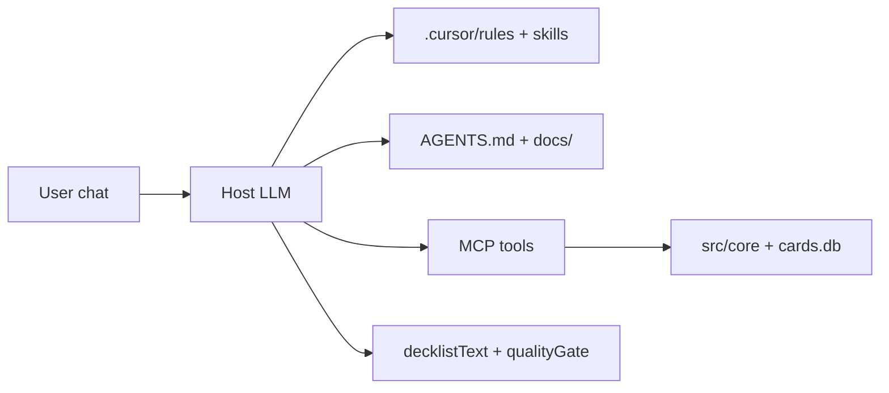

# Agent chat setup — best Commander decks in this repo

This project is designed so **the host LLM** (Cursor, Claude Desktop, or a Cursor SDK script) is the brain, and the **MCP server** supplies data, build, and validation.

## Recommended architecture

Do **not** embed a second LLM inside the MCP stdio process for normal builds. Use the host agent loop: `get_synergies` → user picks slug → (optional `get_user_deck_style`) → `build_deck_from_commander` (`useUserStyleReference: true` by default) → `analyze_deck` → `optimize_deck` as needed.

**User deck library:** import real lists to `data/my_decks` (`npm run decks:download-moxfield`). The build biases mana base from that folder; generated decks must **not** be saved there. See `docs/user-deck-style-reference.md`.

## Option A — Cursor IDE (default)

1. Clone the repo and run setup (`npm install`, `npm run db:create`, `npm run db:import`).
2. Enable MCP in Cursor: **Settings → MCP** → add this server (see [README](../README.md) MCP section).
3. Open the repo folder as workspace so rules and skills load:
   - `AGENTS.md` (canonical workflow)
   - `.cursor/rules/deck-synergy.mdc`, `deck-quality-checklist.mdc`
   - Skills: `mtg-deck-build`, `mtg-deck-optimize`, `mtg-deck-analysis`
4. Start chat with `/mtg-commander` or ask to build a deck for a commander.

The agent should read **`agentBrief`** and **`qualityGate`** on every build/analyze/optimize response before parsing the full JSON.

## Option B — Cursor SDK script (headless / custom UI)

For a dedicated “deck agent” process outside the IDE:

1. Install SDK: `npm install @cursor/sdk` (in your app, not required by this package).
2. Copy and adapt `scripts/deck-agent.example.mjs`.
3. Set `CURSOR_API_KEY` and point `mcpServers` at this repo (`npm run mcp`, correct `cwd`).
4. Seed the agent with `AGENTS.md` or MCP prompt `build-commander-deck`.

See also `scripts/deck-agent.example.mjs` and `.cursor/plans/scout-2026-04-10-commander-deck-chat-flow.md` for Cursor SDK tradeoffs (avoid MCP → SDK → same MCP recursion).

## MCP surfaces for agents

| Surface | Use |
|---------|-----|
| **Tools** | Mutations and validation (`build_deck_from_commander`, `get_user_deck_style`, `analyze_deck`, …) |
| **Resources** | Template, banlist, strategy guides, user style profile (`mtg-commander:///user-decks/…`) |
| **Prompts** | `build-commander-deck`, `optimize-decklist` workflow templates |

## Response fields (read first)

| Field | Tools | Action |
|-------|-------|--------|
| `agentBrief` | build, analyze, optimize | Compact status — read before full `analysis` |
| `qualityGate.readyToShip` | build, analyze, optimize | Do not deliver until `true` or user accepts polish |
| `converged` / `remainingGaps` | build, analyze, optimize | Loop until converged |
| `decklistText` | build, analyze, optimize | Final pasteable list |
| `analysis.unresolvedCardNames` | analyze | Fix names via `resolve_card` / `search_cards` |

## Troubleshooting

| Symptom | Fix |
|---------|-----|
| MCP errored | Check Node LTS, `npm run mcp`, workspace `cwd` |
| `search_cards.databaseReady === false` | `npm rebuild better-sqlite3`; `db:create` + `db:import` |
| Unknown `preferredStrategy` | Call `get_synergies`; use returned slug |
| Low synergy | `optimize_deck` with same slug; cut off-theme cards (hints in `analysis.notes`) |

Full guide: [agent-mcp-troubleshooting.md](./agent-mcp-troubleshooting.md).

## Quality bar

Before shipping a list to the user, satisfy `.cursor/rules/deck-quality-checklist.mdc` and `qualityGate.readyToShip === true` when using `analyze_deck`.
